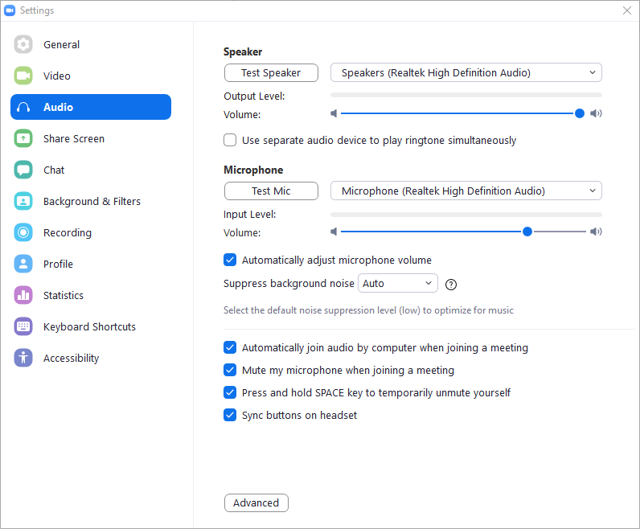

# Zoom+Obs-Automation
An Automation script to automatically join a scheduled zoom meeting at a specific time and record the meeting with obs studio without manual labour.

## Requirements 
- [x] python version above 3.5
- [x] Obs Studio (x64-bit)
- [x] Updated Zoom Software (Signed in)
- [x] pyautogui package
- [x] schedule package

#### To install the above packages :
+ To [Download Python](https://www.python.org/downloads/)
+ To [Download OBS Studio](https://obsproject.com/download)
+ To [Download Zoom Software](https://zoom.us/download#client_4meeting)
+ `pip install pyautogui`
+ `pip install schedule`

## Setting up configurations :

#### OBS Studio settings
+ Set up your obs studio scene as you like or you could import the `obs-scene/sample-scene.json` file into obs studio.
#### Zoom settings
##### Set the Audio Settings as :

##### Set the Video Settings as follows :

# How to run the program :
##### Clone this repository and unzip it
* Open the run.bat and set the paths
  * First Path - "Path to where python is located"
  * Second Path - "Path to where the main.py is located"
* Run the `run.bat` to run the batch file
  * Alternatively you can also run the `main.py` for the same result but `run.bat` is preferred
* *Finally after the cmd is opened read the instructions thoroughly and proceed by entering your zoom meeting info*
* *Make sure you enter the "Meeting ID and Meeting Password" correctly or else the program would crash*
* Format for the Recurring Meeting Time should be in 24 Hour format
  * Eg: `10:45` for 10:45am and `22:45` for 10:45pm 
* Total Meeting time is entered in `minutes` format
  *Eg: `30` for 30mins

## Error Handling
If you get `TypeError: cannot unpack non-iterable NoneType object` then set the second path in `run.bat` file to `main(modified).py` and make sure you have opencv-python package installed.
+ To install opencv-python package : `pip install opencv-python`

This program is tested on 64-bit windows with OBS Studio(64-bit) and zoom(Version: 5.3.1 (52879.0927)).